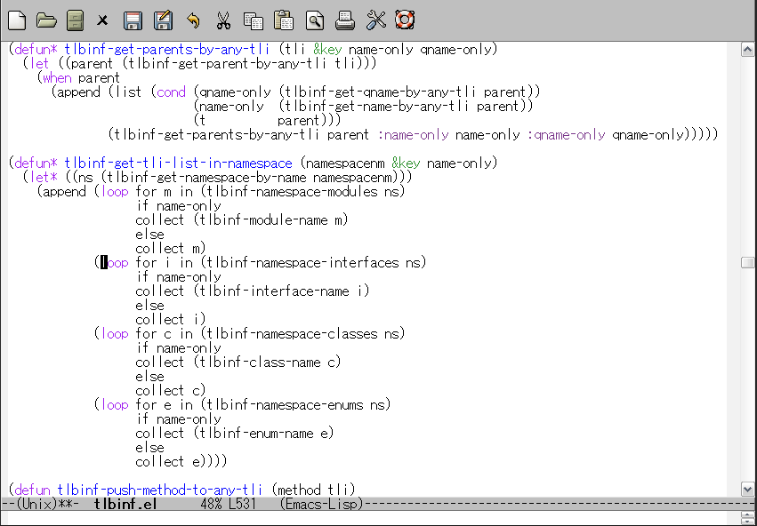

[](https://travis-ci.org/aki2o/log4e)

# What's this?

This is a extension of Emacs provides logging framework for Elisp.  

# Feature

### Define function for logging automatically

Write the following sexp in your elisp file.  

```lisp
(log4e:deflogger "hoge" "%t [%l] %m" "%H:%M:%S")
```

Then, you can use the following function/command.  

-   hoge&#x2013;log-fatal
-   hoge&#x2013;log-error
-   hoge&#x2013;log-warn
-   hoge&#x2013;log-info
-   hoge&#x2013;log-debug
-   hoge&#x2013;log-trace
-   hoge&#x2013;log
-   hoge&#x2013;log-fatal\*
-   hoge&#x2013;log-error\*
-   hoge&#x2013;log-warn\*
-   hoge&#x2013;log-info\*
-   hoge&#x2013;log-debug\*
-   hoge&#x2013;log-trace\*
-   hoge&#x2013;log\*
-   hoge&#x2013;log-set-level
-   hoge&#x2013;log-enable-logging
-   hoge&#x2013;log-disable-logging
-   hoge&#x2013;log-enable-debugging
-   hoge&#x2013;log-disable-debugging
-   hoge&#x2013;log-enable-messaging
-   hoge&#x2013;log-disable-messaging
-   hoge&#x2013;log-debugging-p
-   hoge&#x2013;log-set-coding-system
-   hoge&#x2013;log-set-author-mail-address
-   hoge&#x2013;log-clear-log
-   hoge&#x2013;log-open-log
-   hoge&#x2013;log-open-log-if-debug

For detail, see Usage section.  

### font-lock on logging buffer

Here is the image of logging buffer.


The following face is used for font-lock on logging buffer.  

-   font-lock-doc-face
-   font-lock-keyword-face
-   font-lock-string-face
-   font-lock-warning-face

### key binding on logging buffer

The mode of logging buffer is log4e-mode which is based view-mode.  
The following binding is added.  
-   `J` log4e:next-log &#x2026; move to head of next log
-   `K` log4e:previous-log &#x2026; move to head of previous log

# Install

### If use package.el

2013/07/19 It's available by using melpa.  

### If use el-get.el

2013/07/26 It's available. But, master branch only.  

### If use auto-install.el

```lisp
(auto-install-from-url "https://raw.github.com/aki2o/log4e/master/log4e.el")
```

### Manually

Download log4e.el and put it on your load-path.  

# Usage

For example, develop elisp with prefix "hoge".

### Initially

Write the following in the elisp.

```lisp
(require 'log4e)
(log4e:deflogger "hoge" "%t [%l] %m" "%H:%M:%S" '((fatal . "fatal")
                                                  (error . "error")
                                                  (warn  . "warn")
                                                  (info  . "info")
                                                  (debug . "debug")
                                                  (trace . "trace")))
```

`log4e:deflogger` receives the following arguments.  

1.  The elisp prefix.
2.  Format of log. The following words has a special meaning in it.
    -   %t &#x2026; Replaced with the 3rd argument.
    -   %l &#x2026; Replaced with LogLevel.
    -   %m &#x2026; Replaced with given message by the logging function. About them, see Coding section below.
3.  Format of time. This value is passed to \`format-time-string\` and replaced with its returend.
4.  Alist of the logging function name. This is optional. If nil, This value is \`log4e-default-logging-function-name-alist\`.

### Coding

Develop the elisp with logging.  

```lisp
(defun hoge-do-hoge (hoge)
  (if (not (stringp hoge))
      (progn (hoge--fatal "failed do hoge : hoge is '%s'" hoge)
             (hoge--log-open-log-if-debug))
    (hoge--debug "start do hoge about '%s'" hoge)
    (message "hoge!")
    (hoge--info "done hoge about '%s'" hoge)))
```

The logging functions are named by the 4th argument of `log4e:deflogger`.  
The arguments of them are passed to `format` and its returned is used for the message part of log.  
The returned of them is always nil.

### Enable/Disable logging

By default, logging is disabled.  
For doing logging, use `hoge--log-enable-logging`.  
If you want to do logging anytime, write `hoge--log-enable-logging` in the elisp.  
For stopping logging, use `hoge--log-disable-logging`.

### Set range of logging level

By default, The logging range is from 'info' to 'fatal'.  
So, eval the following &#x2026;

```lisp
(hoge-do-hoge "HOGEGE")
(hoge--log-open-log)
```

Then, the buffer is displayed that named ' \\\*log4e-hoge\\\*'. And the string is like the following.

```
12:34:56 [INFO ] done hoge about 'HOGEGE'
```

If you change the logging range, eval the following sexp.

```lisp
(hoge--log-set-level 'debug 'fatal)
```

Then, eval the following &#x2026;

```lisp
(hoge-do-hoge "FUGAGA")
(hoge--log-open-log)
```

Then, the buffer is displayed that named ' \\\*log4e-hoge\\\*'. And the string is like the following.

```
12:34:56 [INFO ] done hoge about 'HOGEGE'
12:35:43 [DEBUG] start do hoge about 'FUGAGA'
12:35:43 [INFO ] done hoge about 'FUGAGA'
```

If you change the logging range anytime, write `hoge--log-set-level` in the elisp.  
`hoge--log-set-level` receive the following arguments.

1.  The lowest level for doing logging. Its list is 'trace', 'debug', 'info', 'warn', 'error' and 'fatal'.
2.  The highest level for doing logging. This is optional. If nil, This value is 'fatal'.

### For debug

When you debug the elisp, eval the following &#x2026;

```lisp
(hoge--log-enable-debugging)
(hoge-do-hoge 'hogege)
```

Then, the buffer is displayed that named ' \\\*log4e-hoge\\\*'. And the string is like the following.

```
12:34:56 [INFO ] done hoge about 'HOGEGE'
12:35:43 [DEBUG] start do hoge about 'FUGAGA'
12:35:43 [INFO ] done hoge about 'FUGAGA'
12:54:32 [FATAL] failed do hoge : hoge is 'hogege'
```

If you want to stop debugging, use `hoge--log-disable-debugging`.  
If you want to verify activity of debugging in the elisp, use `hoge--log-debugging-p`.

By using `hoge--log-enable-debugging`, logging is enabled too.

### Dump log into other buffer

You are able to dump the same log into other area with logging to standard log buffer
by `hoge--log-enable-messaging`.  
The command receives an argument as a buffer. In default, it's echo area.  
For stopping to dump, use `hoge--log-disable-messaging`.  

### Inhibit logging statement evaluation

Arguments of logging function are evaluated even if the logging level is not a logging range
or logging is disabled like the following code.  

```lisp
(hoge--log-set-level 'info 'fatal)
(hoge--log-disable-logging)
(hoge--debug "%s" (very-big-cost-function)) ; <= This is done in any situation
(some-action)                               ; <= This will be not started until very-big-cost-function is finished
```

In the case, you are able to inhibit the evaluation using a macro version of the logging function
like the following code.  

```lisp
(hoge--log-set-level 'info 'fatal)
(hoge--log-disable-logging)
(hoge--debug* "%s" (very-big-cost-function)) ; <= This is done only if this should be logged
(some-action)                                ; <= This will be started soon
```

But, if the macro version is used frequently, the compiled file size might come big.  

### Free log level function

If you want to do logging with changing log level by some condition locally, use `hoge--log`.  
`hoge--log` is base of the logging function. About them, see Coding section above.  
It receive a log level as 1st argument.

### Insert logging statement quickly

You are able to insert logging statement quickly using `log4e:insert-start-log-quickly`.  




If you want to bind some key to the command,
write like the following in your .emacs or site-start.el file.  

```lisp
(define-key emacs-lisp-mode-map (kbd "C-\\") 'log4e:insert-start-log-quickly)
```

### Clean log buffer

If you want to clear the log buffer named ' \\\*log4e-hoge\\\*', use `hoge--log-clear-log`.  

# Tested On

-   Emacs &#x2026; GNU Emacs 23.3.1 (i386-mingw-nt5.1.2600) of 2011-08-15 on GNUPACK

**Enjoy!!!**
