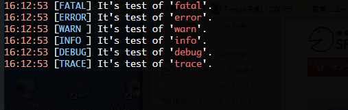

What's this?
============

This is a extension of Emacs provides logging framework for Elisp.

Feature
=======

### Define function for logging automatically

Write the following sexp in your elisp file.

    (log4e:deflogger "hoge" "%t [%l] %m" "%H:%M:%S")

Then, you can use the following function/command.

* hoge--log-fatal
* hoge--log-error
* hoge--log-warn
* hoge--log-info
* hoge--log-debug
* hoge--log-trace
* hoge--log
* hoge--log-set-level
* hoge--log-enable-logging
* hoge--log-disable-logging
* hoge--log-enable-debugging
* hoge--log-disable-debugging
* hoge--log-debugging-p
* hoge--log-set-coding-system
* hoge--log-set-author-mail-address
* hoge--log-clear-log
* hoge--log-open-log
* hoge--log-open-log-if-debug

For detail, see Usage section.

### font-lock on logging buffer

The image of logging buffer is the following ...

The following face is used for font-lock on logging buffer.

* font-lock-doc-face
* font-lock-keyword-face
* font-lock-string-face
* font-lock-warning-face

### key binding on logging buffer

The mode of logging buffer is log4e-mode which is based view-mode.  
The following binding is added.

* J - log4e:next-log ... move to head of next log
* K - log4e:previous-log ... move to head of previous log.

Install
=======

You can install by the following way.

### By el-get

It's currently in preparation.

### By auto-install

Eval the following sexp.

    (auto-install-from-url "https://raw.github.com/aki2o/log4e/master/log4e.el")

### Otherwise

Download "log4e.el" manually and put it in your load-path.

Usage
=====

